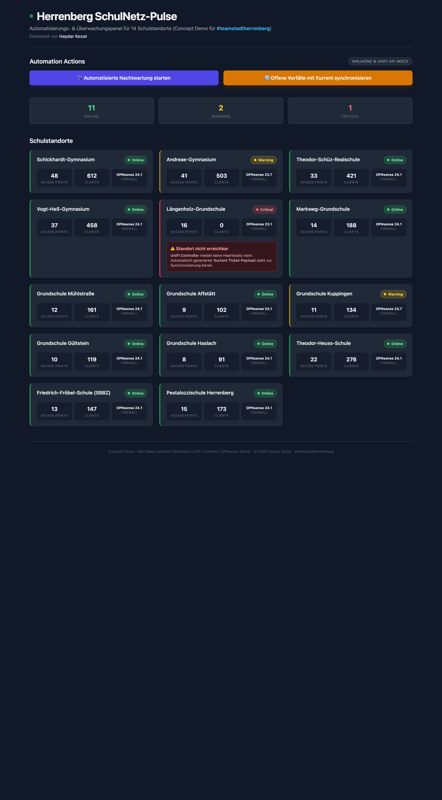

# 🏫 Herrenberg SchulNetz-Pulse

**Automatisierungs- & Überwachungspanel für 14 Schulstandorte**
_Concept Demo für **#teamstadtherrenberg**_

[](https://github.com/haydarkozat/herrenberg-schulnetz-pulse/actions/workflows/ci.yml)

> Eine eigenständige FastAPI-Demo, die ein zentrales Monitoring- und Automatisierungs-Dashboard
> für die Schulnetze der Stadt Herrenberg simuliert. Entwickelt als Konzept-Showcase für ein
> Bewerbungsgespräch als **IT-Systemadministrator**.
>
> **Entwickelt von: Haydar Kozat**

---

## 📸 Vorschau

### Dashboard (Live-Status)
Dunkles Lagebild über alle 14 Standorte – farbcodierte Status-Badges (Online / Warning / Critical),
Access-Point- und Client-Zahlen sowie Firewall-Version je Standort. Kritische Standorte zeigen einen
Alarm mit Verweis auf **UniFi Controller** und den vorbereiteten **Xurrent Ticket-Payload**.



### Nach automatisierter Nachtwartung
Ein Klick auf **„Automatisierte Nachtwartung starten"** überführt alle `Warning`-Standorte nach
`Online` und markiert die Firmware als `(Updated)` – die Statusleiste springt auf **13 Online / 0 Warning**.


---

## ✨ Features

- **Live-Dashboard** mit 14 Herrenberger Schulstandorten in einem responsiven CSS-Grid
- **Status-Monitoring** – Online / Warning / Critical, farbcodierte Karten & Badges
- **Automation Actions** (Mock von **NinjaOne & UniFi API**):
  - 🛠️ **Automatisierte Nachtwartung** (`POST /maintain`) – setzt `Warning → Online`, Firmware-Update
  - 🔄 **Xurrent-Synchronisierung** (`POST /sync-xurrent`) – erzeugt Ticket-Payload-Logs für kritische Standorte
- **Incident-Alarm** für kritische Standorte mit Bezug zu **UniFi Controller** & **Xurrent ITSM**
- **Dark-Mode UI** mit Tailwind CSS (via CDN), keine Build-Pipeline nötig
- **Containerisiert** – läuft mit einem `docker run` Befehl

## 🧰 Tech-Stack

| Komponente   | Technologie            |
|--------------|------------------------|
| Backend      | FastAPI 0.110.0        |
| Server       | Uvicorn 0.28.0         |
| Templating   | Jinja2 3.1.3           |
| Frontend     | Tailwind CSS (CDN)     |
| Runtime      | Python 3.10 (slim)     |
| Container    | Docker                 |

> ℹ️ Alle Daten sind **simuliert** (Mock von NinjaOne / UniFi Controller / Xurrent / OPNsense).
> Es bestehen keine Verbindungen zu produktiven Systemen.

## 🚀 Schnellstart

### Mit Docker (empfohlen)

```bash
docker build -t schulnetz-pulse .
docker run -p 8000:8000 schulnetz-pulse
```

Dann im Browser öffnen: **http://127.0.0.1:8000**

### Lokal mit Python

```bash
pip install -r requirements.txt
uvicorn main:app --reload
```

### Fertiges Image aus der GitHub Container Registry (GHCR)

Bei jedem Versions-Tag (`vX.Y.Z`) wird automatisch ein Image nach `ghcr.io` veröffentlicht:

```bash
docker run -p 8000:8000 ghcr.io/haydarkozat/herrenberg-schulnetz-pulse:latest
```

## 🔌 API-Endpunkte

| Methode | Pfad             | Beschreibung                                                        |
|---------|------------------|---------------------------------------------------------------------|
| `GET`   | `/`              | Rendert das Dashboard mit dem aktuellen Standort-Status             |
| `POST`  | `/maintain`      | Nachtwartung: `Warning → Online`, Firmware als `(Updated)` markiert |
| `POST`  | `/sync-xurrent`  | Erzeugt Konsolen-Log mit Xurrent-Ticket-Payload je `Critical`-Standort |

---

<p align="center">
  Concept Demo &middot; <strong>#teamstadtherrenberg</strong> &middot; © 2026 Haydar Kozat
</p>
